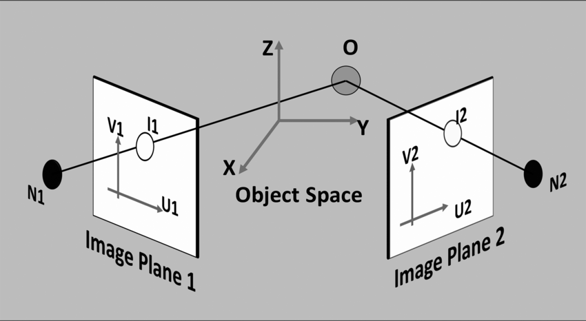
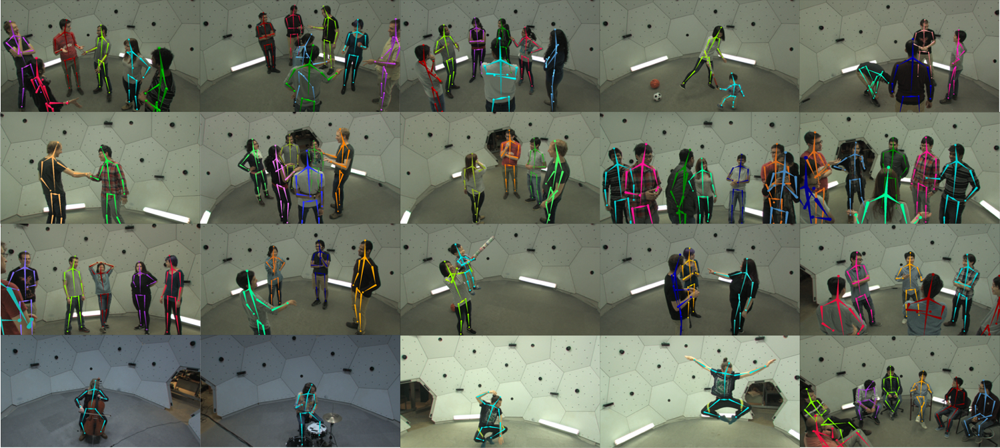
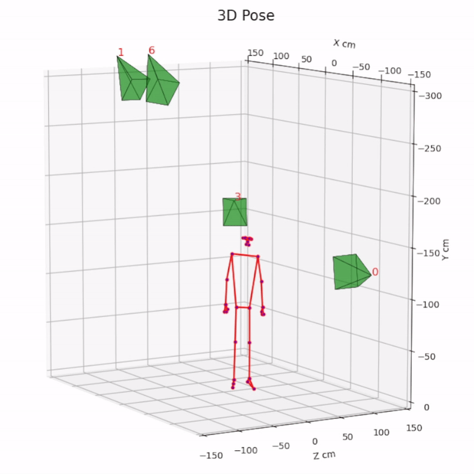
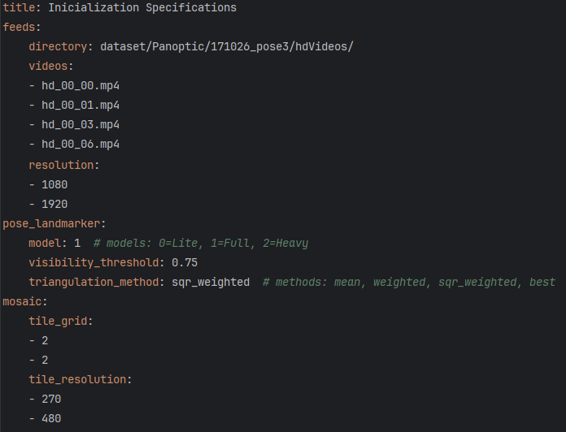

# 3D Human Pose MediaPipe
**Multi-Camera Markerless Human Pose triangulation, with real-time 3D graph feedback.**

## How it works?
- Each camera feed processing is multithreaded for performance increase in I/O bound and blocking operations, such as, 
concurrent image aquisition of videos/cameras and 2D pose inference, while main thread performs triangulation and 3D plotting.


- [MediaPipe Pose](https://developers.google.com/mediapipe/solutions/vision/pose_landmarker), 
developed by Google, is used as the 2D Human Pose inference backbone.
<h6 align="center">MediaPipe Pose - landmark model</h6>
<p align="center">
  
</p>


- The [triangulation](https://youtu.be/nRVuLFQ_Bng) of all the detected poses pairs are calculated using the DLT(Direct Linear Transform) method, making possible to minimize error with imperfect image captures.
<h6 align="center">2D planes to 3D space triangulation</h6>
<p align="center">
  
</p>


## Dataset:
CMU Panoptic dataset used for video feed testing in a controlled environment and ground truth comparison. 
Please refer to [Panoptic-Toolbox](https://github.com/CMU-Perceptual-Computing-Lab/panoptic-toolbox.git) for detailed instructions.
<p align="center">
  
</p>


## Results:

- Multiple perspective mosaic overlaid with poses inference.
<h6 align="center">2D poses mosaic</h6>
<p align="center">
  
</p>
  

- Real-time triangulated pose feedback (with cameras pyramidal field of view).
<h6 align="center">3D pose and cameras pyramids</h6>
<p align="center">
  
</p>


- Dataset ground truth and estimated pose comparison for MPJPE (Mean Per Joint Position Error) calculation.
<h6 align="center">3D MediaPipe pose (red) vs Panoptic Ground Truth (green)</h6>
<p align="center">
  
</p>


### Performance Statistics

| Number of Cameras (_Full_) (_Visibility<sup>2</sup>_)         | MPJPE (mm)  | Mean Inference time (ms) | Mean Triangulation time (ms) | Mean 3D draw time (ms) | Mean FPS    |
|---------------------------------------------------------------|-------------|--------------------------|------------------------------|------------------------|-------------|
| **3** (3 pairs combinations)                                  | 38.68       | 31.66                    | 0.43                         | 19.01                  | **_16.82_** |
| <span style="color:green">**4** (6 pairs combinations)</span> | 32.37       | 32.62                    | 0.81                         | 20.99                  | 15.82       |
| **6** (15 pairs combinations)                                 | 31.88       | 36.14                    | 1.85                         | 26.62                  | 13.54       |
| **8** (28 pairs combinations)                                 | 30.24       | 42.53                    | 4.77                         | 34.18                  | 11.03       |
| **9** (36 pairs combinations)                                 | **_29.78_** | 45.44                    | 6.85                         | 41.12                  | 9.92        |


| Triangulation Methods (_4 cameras_) (_Full_)                                    | MPJPE (mm)  | Mean Triangulation time (ms) |
|---------------------------------------------------------------------------------|-------------|------------------------------|
| Best visibility joints                                                          | 44.02       | **_0.70_**                   |
| Mean of joints                                                                  | 35.51       | 0.76                         |
| Visibility weighted average joints                                              | 32.55       | 0.79                         |
| <span style="color:green">Visibility<sup>2</sup> weighted average joints</span> | **_32.37_** | 0.81                         |


| Mediapipe Model (4 cameras) (_Visibility<sup>2</sup>_) | MPJPE (mm)  | Mean Inference Time (ms) |
|--------------------------------------------------------|-------------|--------------------------|
| _Lite_                                                 | 40.35       | **_24.48_**              |
| <span style="color:green">_Full_</span>                | 32.37       | 32.62                    |
| _Heavy_                                                | **_30.42_** | 103.28                   |


> Cameras used: 0, 1, 3, 6, 13, 16, 21, 25, 30.
 
> Test Machine specification: Ryzen 7 3700X, 16 GB RAM, Python 3.11.5.


## Installation:

1. Clone this repo

2. Download dataset: ["171026_pose3"](http://domedb.perception.cs.cmu.edu/171026_pose3.html) (21 GB)\
_OBS:_ Smaller dataset sample ["171204_pose1_sample"](https://github.com/CMU-Perceptual-Computing-Lab/panoptic-toolbox?tab=readme-ov-file#2-download-a-sample-data-and-other-data) (975 MB) can be downloaded in panoptic-toolbox scripts.

3. Place hdVideos and extract hdPose3d in [dataset/Panoptic/171026_pose3](dataset/Panoptic/171026_pose3)
4. Install dependencies: `pip install -r requirements.txt`

<h6 align="left">Dataset directory tree from 3D Human Pose MediaPipe root</h6>

```
${3D_Human_Pose_MediaPipe}
├─── dataset
│    └─── Panoptic
│         └─── 171026_pose3
│              ├─── hdPose3d_stage1_coco19
│              │    ├─── body3DScene_00000129.json
│              │    ⋮
│              │    └─── body3DScene_00007309.json
│              ├─── hdVideos
│              │    ├─── hd_00_00.mp4
│              │    ⋮
│              │    └─── hd_00_30.mp4
│              └─── calibration_171026_pose3.json
```


## Usage:


<h5>Main 3D pose application</h5>

`python main_3d_human_pose.py`

<h5>MPJPE 3D pose application</h5>

`python mpjpe_evaluation.py`

Cameras selection and basic modifications can be made in [inicialization.yaml](inicialization.yaml).


